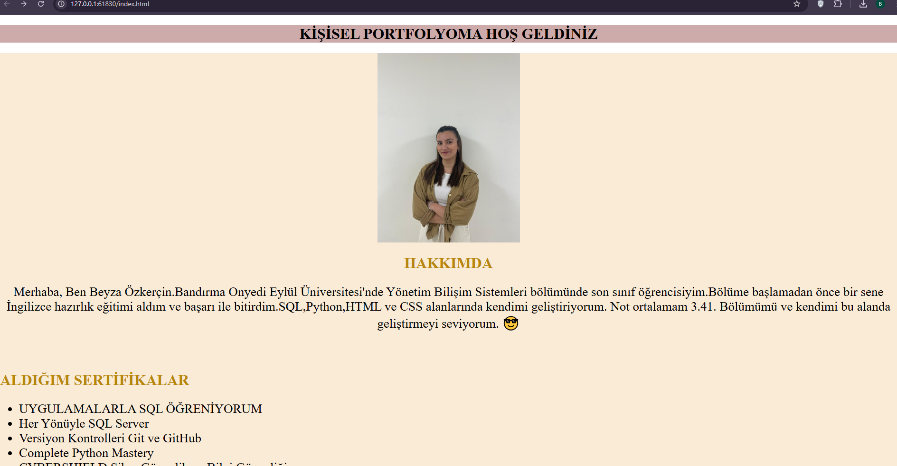
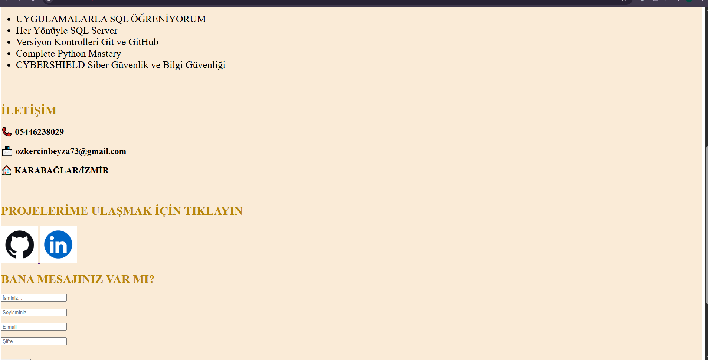
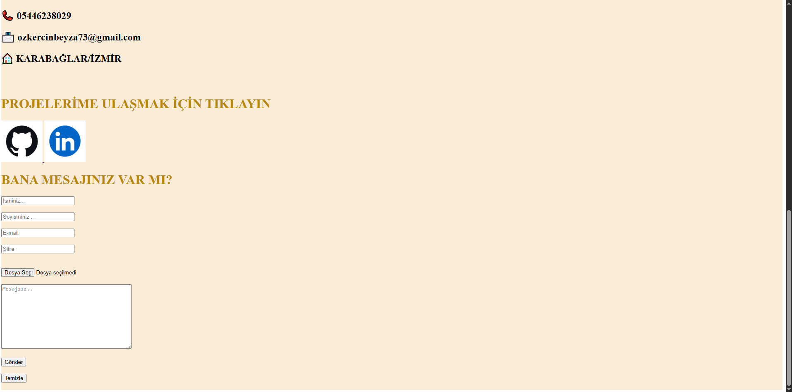

Bu projede öğrenmiş olduğum HTML etiketleriyle basit bir CV örneği hazırladım.
h1,br,div,p etiketlerini kullandım.
CSS'le renklendirme yaptım.Yazı boyutlarını değiştirdim.
Link verdim ve fotoğraflar ekledim.
Son olarak bir form oluşturdum.
Sitemin görünümü bu şekildedir.

